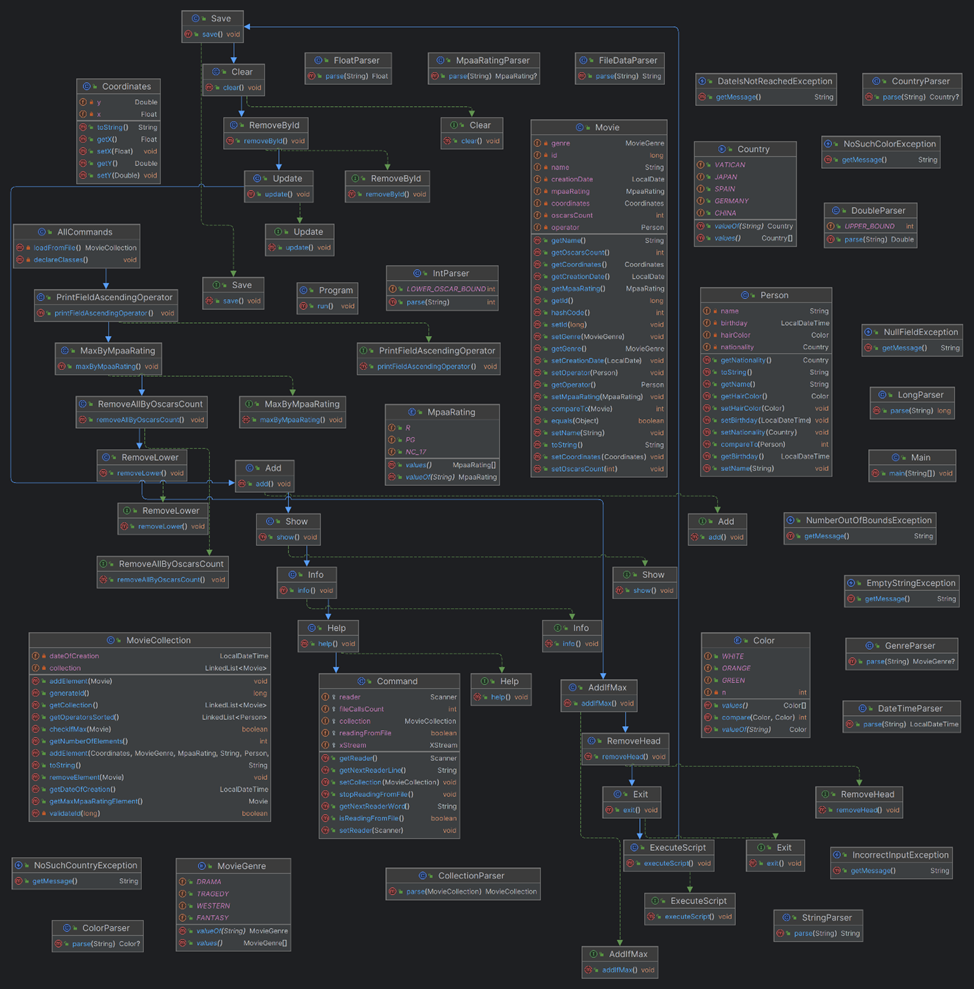

# Лабораторная работа №5 по Программированию

**Вариант 2829**

## Текст задания

Реализовать консольное приложение, которое реализует управление коллекцией объектов в интерактивном режиме. В коллекции необходимо хранить объекты класса Movie, описание которого приведено ниже.
**Разработанная программа должна удовлетворять следующим требованиям:** \
•	Класс, коллекцией экземпляров которого управляет программа, должен реализовывать сортировку по умолчанию. \
•	Все требования к полям класса (указанные в виде комментариев) должны быть выполнены. \
•	Для хранения необходимо использовать коллекцию типа _java.util.LinkedList_ \
•	При запуске приложения коллекция должна автоматически заполняться значениями из файла. \
•	Имя файла должно передаваться программе с помощью: **переменная окружения**. \
•	Данные должны храниться в файле в формате _xml_ \
•	Чтение данных из файла необходимо реализовать с помощью класса _java.util.Scanner_ \
•	Запись данных в файл необходимо реализовать с помощью класса _java.io.BufferedOutputStream_ \
•	Все классы в программе должны быть задокументированы в формате javadoc. \
•	Программа должна корректно работать с неправильными данными (ошибки пользовательского ввода, отсутсвие прав доступа к файлу и т.п.). 

**В интерактивном режиме программа должна поддерживать выполнение следующих команд:** \
•	_help_ : вывести справку по доступным командам \
•	_info_ : вывести в стандартный поток вывода информацию о коллекции (тип, дата инициализации, количество элементов и т.д.) \
•	_show_ : вывести в стандартный поток вывода все элементы коллекции в строковом представлении \
•	_add {element}_ : добавить новый элемент в коллекцию \
•	_update id {element}_ : обновить значение элемента коллекции, id которого равен заданному \
•	_remove_by_id id_ : удалить элемент из коллекции по его id \
•	_clear_ : очистить коллекцию \
•	_save_ : сохранить коллекцию в файл \
•	_execute_script file_name_ : считать и исполнить скрипт из указанного файла. В скрипте содержатся команды в таком же виде, в котором их вводит пользователь в интерактивном режиме. \
•	_exit_ : завершить программу (без сохранения в файл) \
•	_remove_head_ : вывести первый элемент коллекции и удалить его \
•	_add_if_max {element}_ : добавить новый элемент в коллекцию, если его значение превышает значение наибольшего элемента этой коллекции \
•	_remove_lower {element}_ : удалить из коллекции все элементы, меньшие, чем заданный \
•	_remove_all_by_oscars_count oscarsCount_ : удалить из коллекции все элементы, значение поля oscarsCount которого эквивалентно заданному \
•	_max_by_mpaa_rating_ : вывести любой объект из коллекции, значение поля mpaaRating которого является максимальным \
•	_print_field_ascending_operator_ : вывести значения поля operator всех элементов в порядке возрастания 

**Формат ввода команд:** \
•	Все аргументы команды, являющиеся стандартными типами данных (примитивные типы, классы-оболочки, String, классы для хранения дат), должны вводиться в той же строке, что и имя команды. \
•	Все составные типы данных (объекты классов, хранящиеся в коллекции) должны вводиться по одному полю в строку. \
•	При вводе составных типов данных пользователю должно показываться приглашение к вводу, содержащее имя поля (например, "Введите дату рождения:") \
•	Если поле является enum'ом, то вводится имя одной из его констант (при этом список констант должен быть предварительно выведен). \
•	При некорректном пользовательском вводе (введена строка, не являющаяся именем константы в enum'е; введена строка вместо числа; введённое число не входит в указанные границы и т.п.) должно быть показано сообщение об ошибке и предложено повторить ввод поля. \
•	Для ввода значений null использовать пустую строку. \
•	Поля с комментарием "Значение этого поля должно генерироваться автоматически" не должны вводиться пользователем вручную при добавлении.

**Описание хранимых в коллекции классов:**

```
public class Movie {
    private long id; //Значение поля должно быть больше 0, Значение этого поля должно быть уникальным, Значение этого поля должно генерироваться автоматически
    private String name; //Поле не может быть null, Строка не может быть пустой
    private Coordinates coordinates; //Поле не может быть null
    private java.time.ZonedDateTime creationDate; //Поле не может быть null, Значение этого поля должно генерироваться автоматически
    private int oscarsCount; //Значение поля должно быть больше 0
    private MovieGenre genre; //Поле не может быть null
    private MpaaRating mpaaRating; //Поле может быть null
    private Person operator; //Поле может быть null
}
public class Coordinates {
    private Float x; //Поле не может быть null
    private float y; //Максимальное значение поля: 274
}
public class Person {
    private String name; //Поле не может быть null, Строка не может быть пустой
    private java.time.LocalDate birthday; //Поле может быть null
    private Color hairColor; //Поле может быть null
    private Country nationality; //Поле может быть null
}
public enum MovieGenre {
    WESTERN,
    DRAMA,
    TRAGEDY,
    FANTASY;
}
public enum MpaaRating {
    PG,
    R,
    NC_17;
}
public enum Color {
    GREEN,
    ORANGE,
    WHITE;
}
public enum Country {
    GERMANY,
    SPAIN,
    CHINA,
    VATICAN,
    JAPAN;
}
```

## Диаграмма классов разработанной программы



## Исходный код

[тык](src)